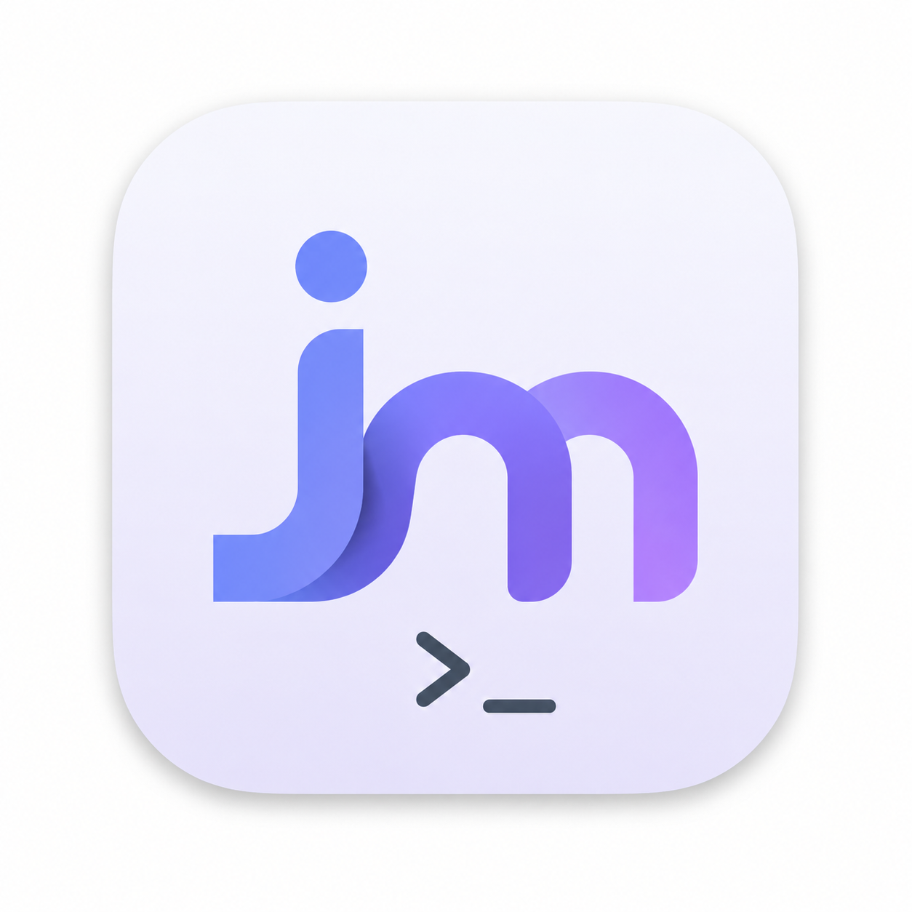

<p align="center">
  
</p>

<h1 align="center">JMComic</h1>

<p align="center">
  原生 SwiftUI 漫画阅读器 · macOS + iOS · 零第三方依赖
</p>

<p align="center">
  
  
  
  
  
</p>

<p align="center">
  <a href="#-下载安装">📦 下载</a> ·
  <a href="#-功能">✨ 功能</a> ·
  <a href="#-构建">🔨 构建</a> ·
  <a href="#-隐私与安全">🔒 隐私</a> ·
  <a href="#-免责声明">⚠️ 免责</a>
</p>

---

一个为个人使用而生的原生阅读器，用 SwiftUI + SwiftPM 从零搭建，**不依赖任何第三方库**。所有网络、加密、图片解码都用 Apple 原生 API 实现，启动快、体积小、行为可控。

包含两个独立端：

| 端 | 目录 | 说明 |
| --- | --- | --- |
| 🖥️ **macOS** | `jmcomic-swift/` | 完整桌面阅读器，SwiftPM 工程 |
| 📱 **iOS** | `jmcomic-ios/` | 独立 iPhone 应用，可与桌面端局域网同步 |

## 📦 下载安装

前往 [Releases](https://github.com/yxxbc/jmcomic-app/releases) 下载最新的 `JMComic-*.zip`，解压后包含：

```
JMComic-release/
├── macOS/JMComic.app        ← 拖入「应用程序」即可使用
├── iOS/JMComic-iOS.app     ← 未签名，需 Xcode 签名后安装真机
└── 安装说明.md
```

- **macOS**：拖入「应用程序」，首次打开在「系统设置 → 隐私与安全性」点「仍要打开」。
- **iOS**：iOS 包未签名，用 Xcode 打开 `jmcomic-ios/jmcomic-ios.xcodeproj`，在 Signing & Capabilities 选自己的 Team（免费 Apple ID 即可）后运行到真机。免费签名有效期 7 天。

## ✨ 功能

### 🖥️ macOS 阅读器

- **阅读**：连续滚动 / 单页翻书、键盘翻页、双击放大、沉浸顶栏、跳页条、断点续读
- **浏览**：热门 / 最新 / 历史 / 最近浏览 / 收藏 / 分类（多选精准筛选）/ 为你推荐（本地画像）
- **本地**：收藏分组、整本下载（CBZ / 散图）、目录扫描导入、内容过滤（不感兴趣标签）
- **局域网**：手机扫码阅读、在线设备管理、设备信任开关（不信任设备只读）
- **安全**：AES 加密存储（密钥在钥匙串）、一次性入场 token、密码限流、可选 HTTPS
- **同步**：GitHub 私有仓库加密备份（收藏 + 历史 + 进度），换机一条命令恢复

### 📱 iOS 应用

- 浏览 / 阅读 / 收藏 / 本地库，与 Mac 端功能对齐
- **桌面端同步**：扫描桌面端二维码配对，局域网内阅读桌面端已下载的漫画

## 🔨 构建

### macOS

```bash
cd jmcomic-swift
swift run -c release              # 直接运行
./build-app.sh --install          # 打包并安装到 /Applications
```

### iOS

Xcode 打开 `jmcomic-ios/jmcomic-ios.xcodeproj`，选自己的 Team 后运行到真机；或编译验收（模拟器）：

```bash
cd jmcomic-ios
DEVELOPER_DIR=/Applications/Xcode.app/Contents/Developer bash build.sh
```

## 🧱 架构

```
jmcomic-swift/Sources/JMComic/
├── App.swift                入口 + 路由
├── Core/                    actor 并发核心
│   ├── JmClient.swift       域名轮换 + 签名请求 + 解密
│   ├── ImagePipeline.swift  ImageIO 解码 → CGImage 切块重排
│   ├── ImageStore.swift     内存 LRU + 磁盘缓存 + 请求合并
│   ├── CryptoStore.swift    AES 加密存储（密钥在钥匙串）
│   ├── SyncStore.swift      GitHub 私有仓库加密同步
│   └── ...
└── UI/                      SwiftUI 视图
```

**关键设计**：actor 保证并发安全、零依赖、图片解重组不重编码、域名失败自动轮换、AES 密钥落钥匙串且文件权限 0600。

> 详见 [CLAUDE.md](CLAUDE.md) 与 [API.md](API.md)。

## 🔒 隐私与安全

- 历史 / 收藏 / 进度全部 AES 加密落盘，密钥在 macOS 钥匙串，文件权限 `0600`
- Web 访问三门槛：一次性 token → 短时凭证 → 密码会话（绑定 IP + 限流）
- 数据同步到自己的 GitHub 私有仓库，仓库里只有密文

## ⚠️ 免责声明

本项目仅用于个人技术学习与合法用途。**不包含**任何内容站点的接口密钥、签名或逆向细节；请勿用于违反法律法规或平台规则的行为，使用者自行承担一切责任。

## 📄 License

[MIT](LICENSE) © 2025 JUKOMU
